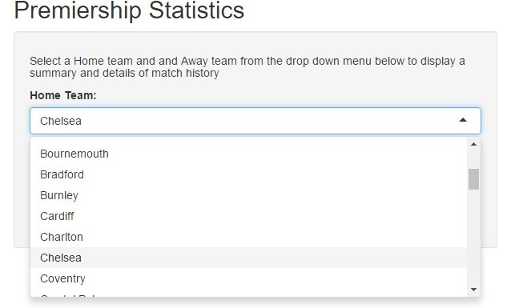

premstats_presentation
========================================================
author: Jorgen Engmann
date: 11/08/2016
width: 1440
height: 1200

Introduction
========================================================

This presentation introduces an app which can be used to
review English Premier League statistics between
1993/94 and 2015/16 seasons.  

It will show

- How to access the site
- How to view the history of any particular fixture

Data used are compiled from

<http://www.football-data.co.uk>

The idea is that for every upcoming match in the new season a fan may want to view the history of the match

Accessing the site
========================================================
- The site is hosted on shinyapps

<https://oljee.shinyapps.io/premstats/>

- On the front page there are two panels

  - one on the left prompting the selection of the Home and Away teams.
  - the other on the right showing 3 tables
      - a __summary__ of match history (number of home wins W, draws D and away wins A)
      - __details__ of the selected match history
      - a __cummulative table__ of results between 1993/94 and 2015/16 seasons
    
Selecting teams 
========================================================
 - In the left tab select a Home Team and Away team from the drop down menu
 - The script is responsive so you will immediately see on the right panel some results informing you about the history of that particular fixture



Results
==========================================================
The example pictured above requested a match history of Chelsea Vs Arsenal with Chelsea being the home team
The results would look similar to this below, but formatted better on the shiny app


```
   H D A
1 10 6 7
```

Showing that Chelsea had won 10 times but lost to Arsenal 7 times at home since 1993/94.
Below that you would see some details of results.  This is R's representation of the last three matches of this particular fixture  


```
  season Div     Date HomeTeam AwayTeam FTHG FTAG FTR
1   1516  E0 19/09/15  Chelsea  Arsenal    2    0   H
2   1415  E0 05/10/14  Chelsea  Arsenal    2    0   H
3   1314  E0 22/03/14  Chelsea  Arsenal    6    0   H
```

This app can be useful to check history of fixtures for any predictions leagues or accumulators you have going.

_Originally produced by J.Engmann as Coursework for Coursera Developing Data Products August 2016_

_Full code is available on github_
